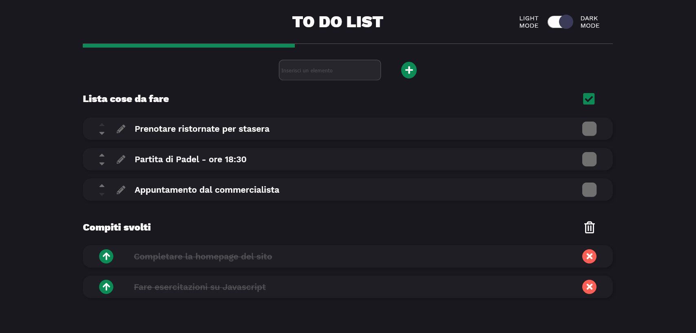

<h1>Realizzazione di una Web App che permette di organizzare la lista delle cose da fare</h1>

La web-app è stata realizzata tramite l'utilizzo di <strong>Javascript</strong> , in particolare attraverso l'uso del framework <strong>Vue.js</strong>. Essa permette di inserire nuovi tasks nella lista, spostare i tasks in ordine di importanza (o secondo i propri criteri organizzativi) e modificare i tasks già inseriti.

Spuntando il box sul lato destro corrispondente al relativo task è possibile spostare lo stesso nella sezione dei <em>"compiti svolti"</em>. Cliccando sulla spunta verde in alto a destra l'utente può spuntare tutti i tasks come completati in una volta sola

Nella sezione <em>"compiti svolti"</em> è possibile ripristinare i tasks così da re-inserirli nella <em>"lista delle cose da fare"</em> oppure eliminarli definitivamente.

Ogni spostamento di tasks viene "monitorato" dalla web-app e permette di far avanzare (o retrocedere) la barra di completamento in alto. <strong>Completando tutti i tasks la barra raggiunge il massimo</strong>

<h2>Dark Mode</h2>

Lo switch in alto a destra permette di passare dalla visualizzazione in "Light Mode" a quella in "Dark Mode" (e viceversa). Il passaggio è graduale e garantisce un minor affaticamento degli occhi in condizioni di scarsa luminosità dell'ambiente

